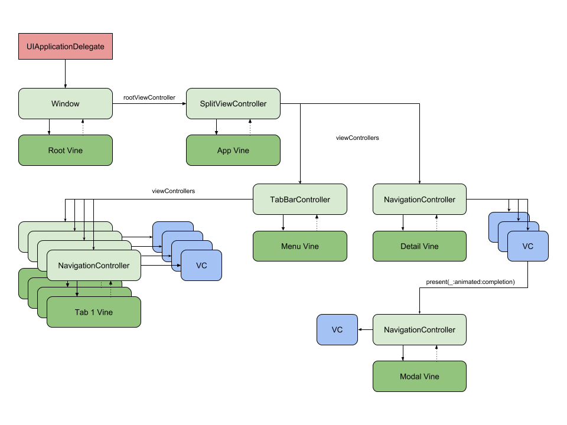
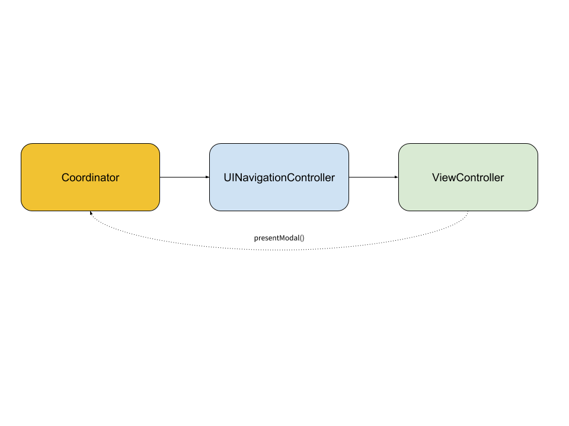
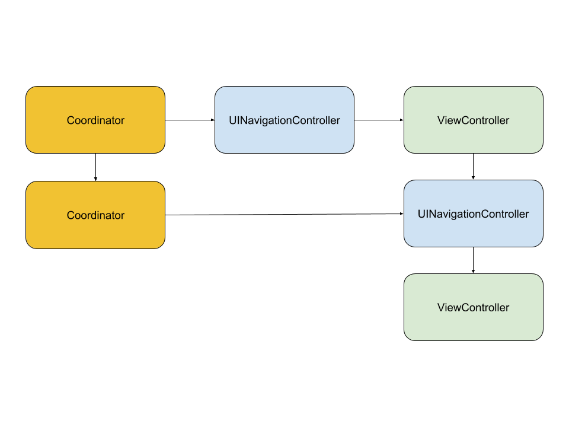

# Vine

[](https://travis-ci.org/Adam/Vine)
[](https://cocoapods.org/pods/Vine)
[](https://cocoapods.org/pods/Vine)
[](https://cocoapods.org/pods/Vine)

## Introduction

Vine is a library for managing navigation in iOS Applications.

Vines are specialized to work with specific UIKit components.
  - `WindowVine` can be used with the Window subclass of `UIWindow`
  - `NavigationControllerVine` can be used with `NavigationController` subclass of `UINavigationController`
  - `SplitViewControllerVine` can be used with `SplitViewController` subclass of `UISplitViewController`
  - `TabBarControllerVine` can be used with `TabBarController` subclass of `UITabBarController`

In the Vine model, the UIKit components hold strong references to the Vines while the Vines have weak references
back to their parent.



## Motivation

Removing navigation logic from view controllers is a good way to separate concerns and increase testability.
The [Coordinator](http://khanlou.com/2015/10/coordinators-redux/) pattern has been written about extensively,
and is widely accepted. However I believe this pattern causes significant memory management overhead and makes
it dangerous to use UIKit navigation methods directly.

Coordinators store a reference to a root UIKit object and an array of child coordinators. When adding a new view controller
with a child coordinator, the parent must hold a strong reference to the child to prevent it from getting deallocated.
When the child view controller is removed, the child coordinator reference also needs to be removed from the parent.
But what happens when a someone doesn't feel like delegating a dismiss command through 4 layers of coordinators and
just calls `dismiss(animated:completion:)` from a random view controller? If that view controller is managed by a coordinator, the coordinator won't
get removed until its parent is removed. If that coordinator is strongly retaining view controllers (quite common from what I've seen)
they will also stay stuck in memory even though they are no longer on screen.

For example, here is a Coordinator managing UINavigationController with initial view controller

The view controller asks the Coordinator to show a modal managed by Child Coordinator

The modal view controller calls `dismiss(animated:completion:)` without telling the parent Coordinator

The modal view controller is dismissed, but the Child Coordinator is still holds a reference to it


Vine takes the opinion that it's better to rely on the navigation hierarchy to manage memory automatically.
Each Vine can operate independently, allowing them to modify the navigation stack without risk of memory leaks.
Additionally, you don't need to worry about using UIKit navigation methods directly in a view controller.
Clean architectures are great but sometimes you just gotta dismiss a modal.

## Example

To run the example project, clone the repo, and run `pod install` from the Example directory first.

## Installation

Vine is available through [CocoaPods](https://cocoapods.org). To install
it, simply add the following line to your Podfile:

```ruby
pod 'Vine'
```

## Author

Adam Cumiskey, adam.cumiskey@gmail.com

## License
Vine is available under the MIT license. See the LICENSE file for more info.
